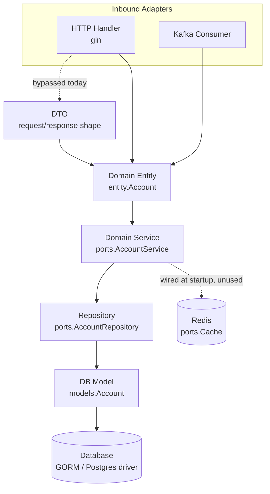

# README

## Overview

Base code to create new another repository

---

## Repository Purpose

* Clean and normalize data from multiple sources
* Prepare data for banking reports
* Support extensible data ingestion (DB, Queue, etc.)
* Follow layered / hexagonal architecture

---

## Layered Architecture

Request/message flow follows the hexagonal layering the root README documents (Config → Provider → Repository → Service), with HTTP and messaging as separate inbound adapters converging on the same domain service:



| Layer            | File(s)                                                                                                                                            | Responsibility                                                 | Status                                                                                                                                                                                                                                             |
| ---------------- | -------------------------------------------------------------------------------------------------------------------------------------------------- | -------------------------------------------------------------- | -------------------------------------------------------------------------------------------------------------------------------------------------------------------------------------------------------------------------------------------------- |
| HTTP             | [`http/server.go`](../internal/adapters/http/server.go), [`http/handler/account-handler.go`](../internal/adapters/http/handler/account-handler.go) | gin engine, route registration, request binding                | Functional                                                                                                                                                                                                                                         |
| DTO              | [`http/dto/account-dto.go`](../internal/adapters/http/dto/account-dto.go)                                                                          | Request/response shape, decoupled from the domain entity       | **Empty file** — handler binds JSON straight to `entity.Account`, so the DTO boundary the base README calls for doesn't exist yet                                                                                                                  |
| Entity           | [`domain/entity/account.go`](../internal/domain/entity/account.go)                                                                                 | Core domain model: `{ID, Username}`                            | Functional (minimal)                                                                                                                                                                                                                               |
| Service          | [`domain/services/account-service.go`](../internal/domain/services/account-service.go)                                                             | Business logic behind `ports.AccountService`; `Save()`         | `Save` calls `repository.Create` and unconditionally returns `nil` — a create failure can't reach the HTTP layer, and `ports.AccountRepository.Create` has no error return at all, so the interface itself needs widening before this can be fixed |
| Repository       | [`adapters/repository/account-repository.go`](../internal/adapters/repository/account-repository.go)                                               | Implements `ports.AccountRepository`; entity ⇄ model mapping   | `Create`, `toModels`, `toDomain` all `panic("unimplemented")` — not functional                                                                                                                                                                     |
| DB Model         | [`database/models/account_models.go`](../internal/adapters/database/models/account_models.go)                                                      | GORM struct, maps to table `account`                           | Functional (minimal)                                                                                                                                                                                                                               |
| DB Provider      | [`database/provider/postgres.go`](../internal/adapters/database/provider/postgres.go)                                                              | Opens the DB connection, pool sizing                           | Named `postgres.go` and exported as `NewMySQLClient`, but opens `gorm.io/driver/mysql` — while `docker-compose.yml` provisions Postgres. Pick one driver and rename to match before wiring the repository up.                                      |
| Cache            | [`adapters/cache/redis.go`](../internal/adapters/cache/redis.go)                                                                                   | Implements `ports.Cache` (get/set/delete with TTL)             | Connected at startup in `application.go` then discarded (`_ = redisCache`) — not used by `AccountService`                                                                                                                                          |
| Composition root | [`internal/application/application.go`](../internal/application/application.go)                                                                    | Wires config → adapters → service → servers, starts everything | Functional                                                                                                                                                                                                                                         |
| Entrypoint       | [`cmd/server/main.go`](../cmd/server/main.go)                                                                                                      | Process entrypoint                                             | Functional                                                                                                                                                                                                                                         |

---

## Setup Guide

### Local Environment

Create environment variables:

```bash
cp .env.example .env
```

Update your local configuration in `.env`

Run the initialization script:

---

```bash
sh init.sh
```

---

### Docker Setup

```bash
docker compose up -d
```

---

## Initializing a New Data Flow

### 1. Define Data Sources

#### From Database

* Implement repository adapters

#### From Queue

* Location: `internal/adapters/consumer`
* Steps:

* Add a new consumer: `{name}Consumer.go`
* Define input DTOs in the `/dto` folder

---

### 2. Define a New Service

1. Define service interface:

   * File: `internal/domain/ports/services.go`

2. Implement service logic:

   * Folder: `internal/domain/services`

3. Inputs & outputs:

   * Use DTOs from `internal/adapters/http` if the service is HTTP-based

---

### 3. Define Outbound Adapters (Repositories)

For database or external storage operations:

1. Define repository interface:

   * `internal/domain/ports/repositories.go`

2. Create adapter struct:

   * `internal/adapters/repositories`

3. Implement repository logic

---

## Service Architecture Layers

```go
Config
  |
DB Provider
  |
Repository (Storage)
  |
Service (Use Case)
```

---

## Database Configuration

* Define database models in:

```go
internal/adapters/database/models
```

---

* **Note**: if your table want to define is SQL please update file **init.sql** your SQL script

---

## Kafka Topic name

Pattern:

```go
<domain>.<entity>.<event>.<version>
```

Rules:

* all lowercase
* use `.` to separate levels, `-` inside a word (never mix `.` and `_`, it breaks Kafka JMX metric names)
* event name is past tense (it is a fact that already happened)
* always add `v1` so you can introduce a breaking schema later
* the first part = the owning service's domain. Only that service may produce to it.

---

## Testing

* Write unit tests for services and repositories
* Mock external dependencies
* Run tests using standard Go **tooling**
* Run `golangci-lint run` for ensure correct syntax

---

## Deployment

* Docker-based deployment
* Environment-driven configuration
* CI/CD friendly

---

## Contribution Guidelines

* Write tests for all new features
* Follow existing code structure
* Code reviews are mandatory

---

## Contact

* Repository owner / admin
* Project team members
